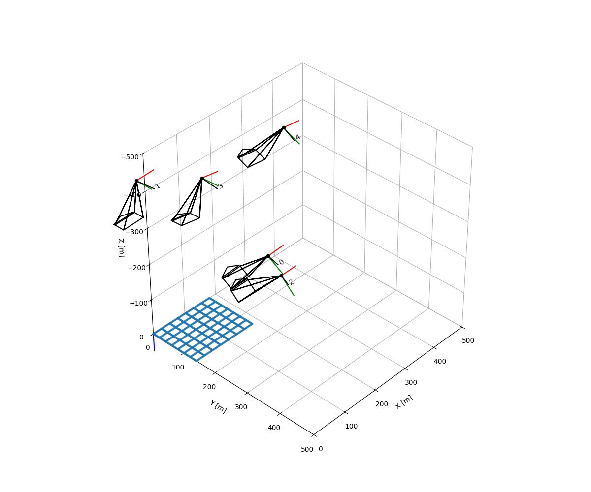
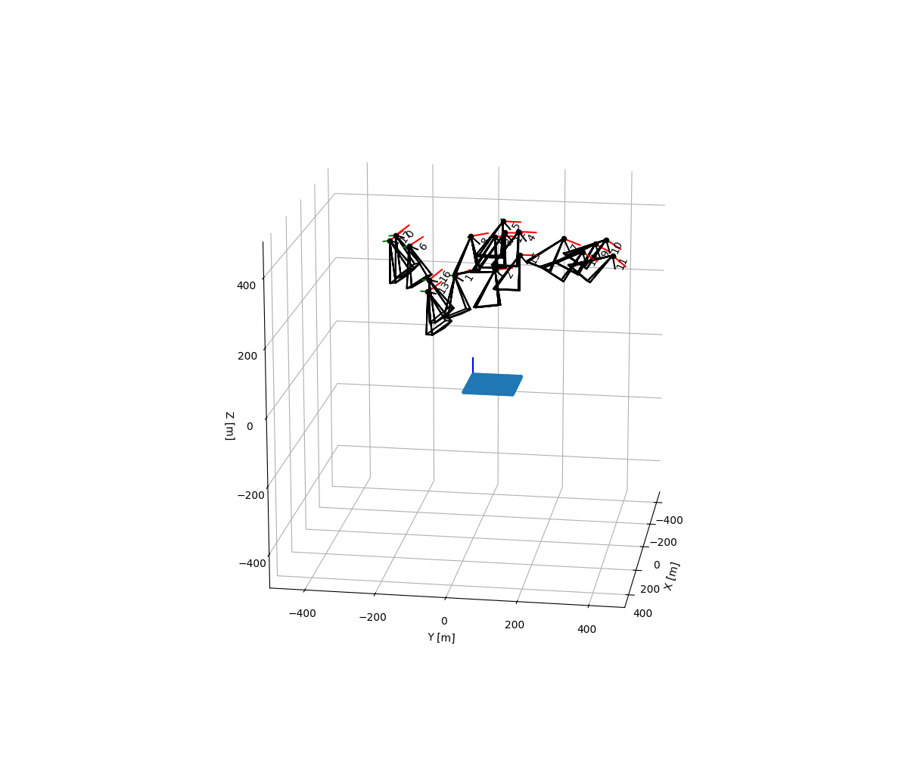

# Zhang-s-Method

Zhang's Method is one of the camera calibration techniques.

## Demo



## Installation

You can install the required packages using requirements.txt file.

```bash
pip install -r /path/to/requirements.txt
```

Also, install next to packages manually.

```bash
opencv
numpy
pytransform3d
```

## Usage

```python
# image_points are lists of points that get a feature extractor on a checkboard.
# world_points are lists of generated get_world_point() function.
Homography = compute_homography(image_points, world_points)

Intrinsic matrix, Inverse of Intrinsic matrix = compute_intrinsic(list of Homograpy)
```

## Contributing

Pull requests are welcome. For major changes, please open an issue first
to discuss what you would like to change.

Please make sure to update tests as appropriate.